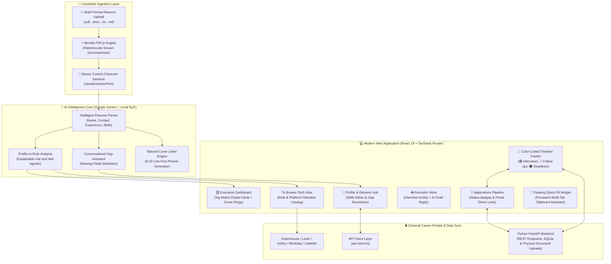

# JobPilot — AI-Powered Career Intelligence & Job Application Tracker

<div align="center">


**JobPilot analyzes profile-to-role fit, provides explainable career-readiness and skill evidence, helps prepare cover letters and interview practice, supports profile-assisted field population, and tracks applications and interview timelines. Candidates review materials and submit applications directly on employer sites.**

[Dashboard](http://localhost:5173/dashboard) • [Browse Jobs](http://localhost:5173/browse) • [Interview Tracker](http://localhost:5173/tracker) • [Candidate Profile](http://localhost:5173/profile)

</div>

---

## 🏗️ System Architecture



---

## 🌟 Comprehensive Features & Capabilities

### 1. ⚡ Client-Side PDF.js & FlateDecode Stream Engine
- **Zero Binary Stream Corruption**: Employs Mozilla PDF.js (`pdfjs-dist`) for in-browser client-side parsing of modern compressed PDF streams (`FlateDecode`), font tables, glyph mappings, and `.docx` XML archives without sending raw documents to external servers.
- **Automated Text Sanitizer (`cleanExtractedText`)**: Cleanses non-printable control characters, null bytes, and normalizes formatting prior to LLM analysis.

### 2. 🎯 Unified Career Intelligence & Next Best Action Coach
- **Explainable 6-Factor Readiness Formula**:
  - Deterministic candidate-to-job calculation balancing Resume Match (35%), Required Skills (20%), Project Evidence (15%), Experience Relevance (10%), Seniority Fit (10%), and Profile Completeness (10%).
  - Never inflates weak candidates with arbitrary defaults; provides actionable positive signals and readiness reducers.
- **Living Career Twin**:
  - Models candidate skills, seniority, experience years, and practical projects.
  - Interactive STAR-method technical interview simulator with instant scoring and qualitative feedback.
- **Evidence-Based Skill Proof Hierarchy**:
  - Tracks skill evidence through 4 rigorous levels: Claimed (25%) → Résumé Mention (50%) → Practical Project Demonstration (75%) → Technical Verification Challenge (100%).
- **Closed-Loop Action Completion Engine**:
  - Completing recommended actions (verifying skills, attaching practical projects, optimizing bullets) updates underlying profile state, triggers immediate Career Intelligence recomputation, and dynamically generates the next prioritized task.

### 3. 🧩 Profile-Assisted Application Preparation
- **Profile Field Copy**: Copy saved contact, experience, and portfolio details for use in supported employer application forms.
- **Master Profile Copy**: Copy profile details to paste into an employer portal.
- **Quick-Fill Helper**: Keep profile details accessible while completing an external application. Review and submit directly on the employer's site.

### 4. ✍️ Tailored First-Person Cover Letter Generator
- **Zero Generic Fluff**: Directly addresses the hiring team and target position.
- **Role-Specific Alignment**: Generates concise, high-impact 8–10 line letters tailored to the candidate's verified skills and the specific job requirements.

### 5. 📅 Color-Coded Interview & Process Timeline Calendar
- **Interactive Multi-Stage Tracking**:
  - 🟢 **Emerald Green**: Scheduled Technical, System Design, and Onsite Interviews.
  - 🔵 **Sky Blue**: Recruiter Outreach & Follow-ups.
  - 🟠 **Amber**: Take-Home Assessments & Coding Deadlines.
  - 🟣 **Purple**: Offer Decision Deadlines and Status Milestones.
- Filter pills, monthly grid, day agenda drawer, and modal for adding new dates.

### 6. 🔒 Production Security, Data Isolation & Fault Tolerance
- **Firebase Authentication & ID Tokens**: Replaced raw local-storage pseudo-auth with full Firebase Auth. The frontend explicitly negotiates short-lived ID tokens (JWT) which the FastAPI backend securely verifies via the Firebase Admin SDK (`auth.verify_id_token`).
- **Strict Cross-User Isolation**: User accounts and database queries are strictly scoped using the decoded `uid` directly from verified Firebase tokens. Development `X-User-Id` bypasses are disabled in production (`DEMO_MODE=false`).
- **Secure File Validation**: `/api/documents/upload` enforces strict server-side MIME-type/extension filtering and a 5MB maximum upload limit, preventing disk exhaustion and malicious executable uploads.
- **Protocol Security**: Zod validation restricts application URLs strictly to `http://` and `https://`, blocking malicious schemes (`javascript:`, `data:`, `vbscript:`).
- **Zod AI Schema Validation & Fallback**: AI extraction is parsed against strict runtime schemas with automatic deterministic fallback if LLM inference times out or fails.

### 7. 🤝 Offer Comparison & Salary Negotiation Coach
- **Offers workspace (`/offers`)**: record offers with base, bonus, signing bonus, equity (spread over its vesting period), retirement match, benefits, PTO, work mode and growth / work-life / culture ratings. Offers can be linked to a tracked application (an application in the **Offer** stage gets a *Compare & negotiate offer* shortcut that pre-fills the form from its salary range).
- **True yearly value**: total comp / yr, first-year total and a flat 4-year value per offer, so a big signing bonus or equity grant can't hide a lower base.
- **Side-by-side comparison**: pick up to 4 offers (same currency), tune the weights (compensation / growth / work-life / culture) and get a ranked weighted score with the best value highlighted in every row.
- **Negotiation coach**: choose a tone (collaborative / firm / enthusiastic), priorities, leverage and selling points. The coach returns a strategy, talking points, a ready-to-send email, a phone script and answers to three likely pushbacks. **Numbers are computed deterministically** (opening ask / target / lowest counter, capped and flagged above +25%) and handed to Gemini, which only writes the words — it can never invent a figure. If the AI is unavailable an offline template is used. Plans are saved on the offer.
- **Deadline reminders**: an offer with a decision deadline creates a `deadline` reminder on the Tracker calendar.

### 8. 🔔 Smart Follow-up Automation
- **Quiet-application detection (`/followups`)**: an application in *Applied*, *Under Review* or *Interview* is "quiet" after a configurable number of days (defaults 7 / 10 / 4) measured from its last update or your last logged follow-up.
- **Auto-created reminders**: quiet applications automatically get a `follow-up` reminder (visible on the Tracker calendar). The scan is idempotent — one open reminder per application, no duplicates — and runs when the app loads (throttled) or via **Scan now**.
- **AI-drafted messages**: one click drafts a polite / friendly / direct email or LinkedIn message that escalates with each follow-up (check-in → add value → graceful close). Placeholders such as `[Recruiter name]` are used instead of invented details; an offline template covers AI outages.
- **Actions**: *Mark as sent* (logs it, completes the open reminder and restarts the clock), *Snooze 3d*, per-user history, and a "consider moving on" list once your max follow-ups are reached.
- **Visibility**: sidebar badge, dashboard "Follow-ups due" card, and voice navigation ("open offers", "go to follow-ups").

#### New API endpoints (all require auth and are scoped to the signed-in user)
| Method | Path | Purpose |
|---|---|---|
| GET / POST | `/api/offers` | List / create offers |
| GET / PATCH / DELETE | `/api/offers/{id}` | Read / update / delete an offer (deleting an application only detaches its offers) |
| POST | `/api/ai/negotiate` | AI negotiation plan (503 when Gemini is not configured → frontend template fallback) |
| GET / PUT | `/api/followups/settings` | Per-user quiet-day thresholds, max follow-ups, auto-reminder switch, default tone |
| GET / POST | `/api/followups/logs` | List / log a sent follow-up (also restarts the application's quiet clock) |
| DELETE | `/api/followups/logs/{id}` | Remove a log entry |
| POST | `/api/ai/followup-email` | AI follow-up draft (503 → frontend template fallback) |

New tables (`offers`, `followup_settings`, `followup_logs`) are created automatically on startup; no migration of existing tables is required.

---

## 📂 Project Structure

```text
Job-Application-Tracker/
├── Frontend/                          # React 19 + TypeScript + Vite Application
│   ├── src/
│   │   ├── components/                # Modular UI Components & Modals
│   │   │   ├── apply-portal-modal.tsx # 1-Click Auto-Fill sheet & Cover Letter
│   │   │   ├── career-twin-section.tsx # Interactive Career Twin & Mock Interview
│   │   │   ├── dashboard-sidebar.tsx  # Navigation sidebar with responsive layout
│   │   │   ├── interview-calendar-modal.tsx # Color-coded timeline calendar
│   │   │   ├── job-career-intelligence-panel.tsx # Intelligence, Proof & Coach panel
│   │   │   ├── missing-fields-modal.tsx # Profile gap detection & resolution
│   │   │   ├── next-best-action-card.tsx # Prioritized Next Best Action card
│   │   │   ├── quick-fill-widget.tsx  # Floating multi-tab ATS assistant
│   │   │   ├── skill-proof-section.tsx # Evidence-based skill verification
│   │   │   ├── suggested-jobs-section.tsx # Curated role matching cards
│   │   │   └── landing/               # Marketing & Landing Page Components
│   │   ├── lib/                       # Core Business Logic & State Services
│   │   │   ├── ai.ts                  # Gemini-backed backend client, schema validation & fallback
│   │   │   ├── api-client.ts          # Unified REST & LocalStorage data adapter
│   │   │   ├── applications-service.ts# Application CRUD & validation rules
│   │   │   ├── auth-context.tsx       # Authentication state provider
│   │   │   ├── career-intelligence.ts # Deterministic Career Intelligence engine
│   │   │   ├── jobs-catalog.ts        # Curated ATS job openings catalog
│   │   │   ├── profile.ts             # Profile management & auto-fill map
│   │   │   ├── reminders-service.ts   # Interview calendar reminders store
│   │   │   ├── resume-parser.ts       # Mozilla PDF.js & DOCX text extraction
│   │   │   ├── validation.ts          # Runtime Zod validation schemas
│   │   │   └── __tests__/             # Vitest Test Suite (78 tests)
│   │   ├── routes/                    # TanStack File-Based Routes
│   │   │   ├── index.tsx              # Landing Page (/)
│   │   │   ├── dashboard.tsx          # Executive Dashboard (/dashboard)
│   │   │   ├── browse.tsx             # Job Discovery (/browse)
│   │   │   ├── applications.index.tsx # Pipeline Management (/applications)
│   │   │   ├── applications.$applicationId.tsx # Application Dossier & Intelligence
│   │   │   ├── inbox.tsx              # Recruiter Messages (/inbox)
│   │   │   ├── tracker.tsx            # Timeline Calendar (/tracker)
│   │   │   ├── profile.tsx            # Résumé Ingestion & Profile Hub (/profile)
│   │   │   └── settings.tsx           # Preferences & Data Management (/settings)
│   │   └── styles.css                 # Tailwind CSS v4 & OKLCH Design Tokens
│   └── package.json
│
├── Backend_FastAPI/                   # Python FastAPI Backend
│   ├── main.py                        # REST API Routes & SQLAlchemy Models
│   ├── requirements.txt               # Python Dependencies
│   └── README.md                      # Backend Documentation
│
├── firestore.rules                    # Firebase Security Rules
└── README.md                          # Master Project Documentation
```

---

## 🛠️ Tech Stack & Dependencies

| Layer | Technologies |
| :--- | :--- |
| **Frontend Framework** | React 19, TypeScript 5.8, Vite 8 |
| **Routing & Architecture** | TanStack Router, TanStack Query |
| **Styling & Design System** | Tailwind CSS v4, Lucide React, Date-fns, Sonner, Vaul |
| **Document Processing** | Mozilla PDF.js (`pdfjs-dist`) with client-side stream decoding |
| **AI & Career Intelligence**| Google Gemini API (backend-only via `GEMINI_API_KEY`) + Local Deterministic Fallback Engine |
| **Backend API** | Python FastAPI (SQLAlchemy, Physical File Management) |
| **Data Persistence** | SQLite Database with automated cascading deletes |
| **Validation & Schemas** | Zod 3.25 runtime validation |
| **Testing** | Vitest, JSDOM, Coverage-v8 (**78/78 passing tests**) |

---

## 🚀 Quick Start & Installation

### Prerequisites
- **Node.js** `v20+` or `v22+`
- **npm** `10+` or **bun**
- **Python 3.9+** (for running the FastAPI backend)

### 1. Clone the Repository
```bash
git clone https://github.com/harshit1arora/Job-Application-Tracker.git
cd Job-Application-Tracker
```

### 2. Configure Environment Variables
Create a `.env` file in `Frontend/` for local development. Firebase web configuration is required for real authentication; Gemini credentials live only on the backend and must never use a `VITE_` variable.
```env
# Firebase Web App configuration
VITE_FIREBASE_API_KEY=your_firebase_api_key
VITE_FIREBASE_AUTH_DOMAIN=your_project.firebaseapp.com
VITE_FIREBASE_PROJECT_ID=your_project_id
VITE_FIREBASE_STORAGE_BUCKET=your_project.firebasestorage.app
VITE_FIREBASE_MESSAGING_SENDER_ID=your_sender_id
VITE_FIREBASE_APP_ID=your_app_id
```

### 3. Start the Development Server
```bash
cd Frontend
npm install
npm run dev
```
Open **`http://localhost:5173`** in your browser.

### 4. Start the FastAPI Backend (Required for DB operations)
```bash
cd Backend_FastAPI
pip install -r requirements.txt
uvicorn main:app --port 5117
```
API runs locally on `http://localhost:5117` and is automatically proxied by Vite. Documents will be saved in `Backend_FastAPI/uploads`.

**Note:** The backend requires `python-multipart` (already included in `requirements.txt`) to process raw `multipart/form-data` during file uploads on strict production WSGI/ASGI servers. Additionally, the backend provides a root `/` endpoint that returns a JSON status message to quickly verify deployment uptime. All other endpoints are strictly prefixed with `/api/` (e.g., `/api/health`).

---

## 🚀 Deployment (Vercel & Render)

1. **Backend via Render**: 
   - A `render.yaml` configuration is included. Connect this repository to Render and create a new **Blueprint**. Render will deploy the FastAPI backend.
   - **Note on Root Directory**: For seamless deployments, a `requirements.txt` is provided at the repository root, and the start command automatically switches to `Backend_FastAPI` before booting. This prevents common `No such file or directory` errors if the service is linked manually.
   - The config automatically mounts a 1GB persistent disk to `/var/data` for the SQLite database and uploaded user resumes, ensuring they survive redeploys.
   - Note the resulting URL (e.g., `https://job-tracker-backend.onrender.com`).
  - Configure `FIREBASE_PROJECT_ID`, `FIREBASE_CLIENT_EMAIL`, `FIREBASE_PRIVATE_KEY`, and `GEMINI_API_KEY` in Render. The production Vercel origin is included in backend CORS configuration.
2. **Frontend via Vercel**: 
   - Import the `Frontend` folder as your project root in Vercel. 
   - Add the environment variable `VITE_API_URL` set to your Render URL (e.g. `https://job-tracker-backend.onrender.com/api`).
   - Also add `VITE_DEMO_MODE=false` and all required `VITE_FIREBASE_*` configuration variables.
   
### Render Troubleshooting & Hotfixes
If your Render build fails with `ERROR: Could not open requirements file: [Errno 2] No such file or directory: 'requirements.txt'`, this typically means you created a Web Service manually instead of using the Blueprint config.
**Instant Fix**:
1. Go to your Web Service **Settings** in the Render Dashboard.
2. Set the **Root Directory** field to `Backend_FastAPI`.
3. Click **Save Changes** and trigger a **Manual Deploy -> Clear build cache & deploy**.
---

## 🧪 Automated Testing

To run the complete automated test suite:

```bash
cd Frontend
npm test
```

### Test Suite Summary

**Backend Tests (Pytest)**
```bash
cd Backend_FastAPI
pytest
```
- Also covers offers CRUD/validation/isolation, follow-up settings & logs, and the AI endpoints (`test_main.py`), plus pure-logic tests in `test_negotiation_logic.py`.
- Passes 6/6 original integration tests covering CRUD operations, physical document uploads, stats generation, cross-user isolation, and production authentication rejection (`test_production_auth_rejection`).

**Frontend Tests (Vitest)**
```bash
cd Frontend
npm run test
```
```text
✓ src/lib/__tests__/documents-service.test.ts (3 tests)
✓ src/lib/ai.test.ts (6 tests)
✓ src/lib/__tests__/voice-assistant.test.ts (11 tests)
✓ src/lib/__tests__/reminders-service.test.ts (3 tests)
✓ src/lib/__tests__/applications-service.test.ts (15 tests)
    ✓ createApplication validation checks
    ✓ CRUD workflow (create, read, update, delete)
    ✓ URL Scheme Security (rejects javascript:, data:, vbscript:)
    ✓ Demo data isolation & cross-user privacy enforcement
✓ src/lib/__tests__/career-intelligence.test.ts (21 tests)
    ✓ 6-factor deterministic readiness scoring & factor breakdown
    ✓ Skill proof hierarchy (Claimed -> Resume -> Project -> Verified)
    ✓ Living Career Twin fit & STAR interview simulation integration
    ✓ Next Best Action determination & action execution feedback loop
    ✓ Deterministic fallback when job matchScore is missing
✓ src/lib/__tests__/resume-ai-pipeline.test.ts (9 tests)
    ✓ AI resume parsing & structured field extraction
    ✓ Profile gap detection for missing application items
    ✓ Zod AI response schema validation & type coercion
    ✓ Deterministic parser fallback when AI output is malformed/unavailable
✓ src/lib/__tests__/profile-mapping.test.ts (2 tests)
✓ src/lib/__tests__/dashboard-service.test.ts (1 test)
✓ src/lib/__tests__/autofill-pipeline.test.ts (5 tests)
✓ src/lib/__tests__/reminders-calendar.test.ts (2 tests)
✓ src/lib/__tests__/offer-math.test.ts (15 tests)
    ✓ Total-comp maths, weighted ranking, counter-offer rules (mirrors the backend), salary-range parsing
✓ src/lib/__tests__/followup-logic.test.ts (17 tests)
    ✓ Quiet detection, thresholds, snooze/exhausted states, idempotent reminder targeting, email template
✓ src/lib/__tests__/offers-service.test.ts (9 tests)
    ✓ Offer CRUD, validation, user isolation, saved plans, deadline-reminder integration
✓ src/lib/__tests__/followups-service.test.ts (10 tests)
    ✓ Settings, logs, auto-reminder scan (idempotent, race-safe), mark-sent, snooze, draft fallback

Test Files  11 passed (11)
     Tests  78 passed (78)
```

---

## 📄 License
This project is open source and available under the [MIT License](LICENSE).

